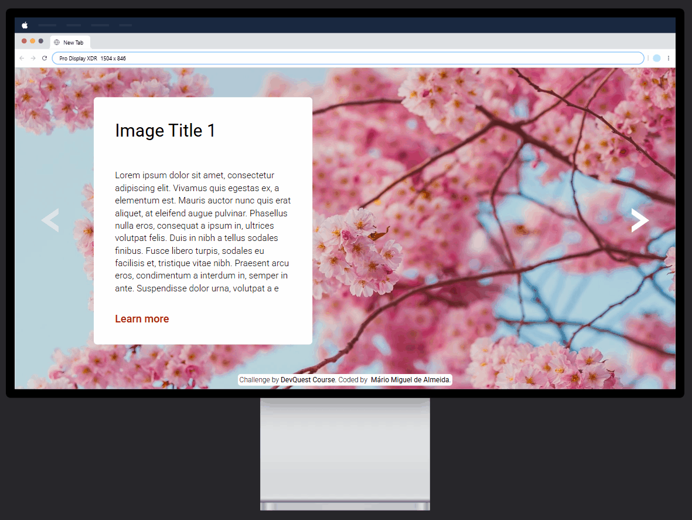
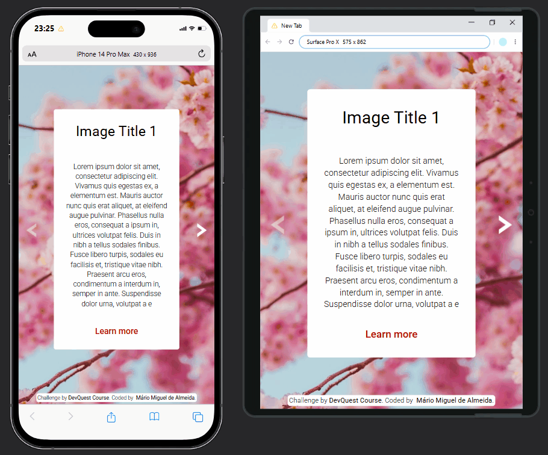

# Image Slider | Exercício DevQuest

## **Sumário**

- [Visualização do Projeto](#visualização-do-projeto)
- [Apresentação](#apresentação)
- [Explicação do Projeto](#explicação-do-projeto)
- [Estrutura do Projeto](#estrutura-do-projeto)
- [Como Utilizar o Código do Projeto](#como-utilizar-o-código-do-projeto)
- [Ferramentas e Tecnologias Utilizadas](#ferramentas-e-tecnologias-utilizadas)
- [Principais Recursos e Abordagens](#principais-recursos-e-abordagens)
- [Desafios Enfrentados](#desafios-enfrentados)
- [Aprendizado Adquirido](#aprendizado-adquirido)
- [Desenvolvimento Contínuo](#desenvolvimento-contínuo)
- [Agradecimentos e Conclusão](#agradecimentos-e-conclusão)
- [Contato](#contato)
- [Licença de Uso](#licença-de-uso)

## **Visualização do projeto**

### **🖥️ Desktop**

<div align="center">
  
</div>

### **📱 Mobile**

<div align="center">
  
</div>

### [Acesse a página clicando aqui!](https://miguel-dalmeida.github.io/huddle-landing-page-with-alternating-feature-blocks_project/) 

## **Apresentação**

Olá! Meu nome é Mário Miguel e sou estudante de Desenvolvimento Web. Atualmente, sou aluno do curso **DevQuest**, da plataforma *Dev em Dobro*, focado na formação de desenvolvedores Fullstack.

Como parte da minha jornada de aprendizado, recriei o desafio **Image Slider**. Esse projeto integra o módulo [**Exercícios JS Intermediário**](https://gigantic-chef-a6f.notion.site/Exerc-cios-JavaScript-Intermedi-rio-222cd10b93ab80e088c8c9613499c79d?source=copy_link) (especificamente o quinto exercício), do curso *DevQuest*.

## **Explicação do Projeto**

O **Image Slider** é um carrossel interativo de imagens, desenvolvido para exercitar a lógica de manipulação do DOM com JavaScript. A ideia principal é permitir a navegação entre diferentes imagens de fundo por meio de setas posicionadas nas laterais da tela.

Funciona assim: ao clicar nas setas de navegação (esquerda ou direita), a imagem de fundo é trocada. Há um total de quatro imagens, e o sistema respeita os limites — ou seja, na primeira imagem a seta de "voltar" aparece opaca (indicando que não há imagem anterior), e na última imagem a seta de "avançar" também fica desabilitada visualmente.

Além do slider em si, o projeto inclui um cartão de conteúdo com fundo branco, posicionado sobre as imagens, onde são exibidos título, parágrafo e um link de ação. Por fim, há um rodapé simples com os créditos do desafio e do desenvolvedor.

Apesar do visual mais clean e simples, o foco do exercício foi, de fato, trabalhar a lógica por trás do comportamento do carrossel — integrando HTML, CSS e, principalmente, JavaScript de forma prática.

## **Estrutura do Projeto**

```plaintext
├── src/
│   ├── css/
│   │   ├── reset.css
│   │   ├── responsive.css
│   │   ├── style.css
│   │   ├── variables.css
│   ├── js/
│   │   ├── index.js
│   ├── images/
│   │   ├── ...
├── index.html
├── README.md
```

## **Como Utilizar o Código do Projeto**

**Para rodar este projeto em sua máquina local, siga os passos abaixo:**

### 1️⃣ Crie um diretório para o projeto  
Escolha um local no seu computador e crie uma pasta para armazenar os arquivos do projeto.

### 2️⃣ Acesse o terminal  
Clique com o botão direito sobre a pasta criada e selecione a opção para abrir o terminal.  

### 3️⃣ Clone o repositório  
No terminal, execute o seguinte comando para clonar o repositório:  
```sh
git clone https://github.com/Miguel-dAlmeida/image-slider__project.git
```
### 4️⃣ Acesse o diretório do projeto
Após a clonagem, entre na pasta do projeto executando o comando abaixo em seu terminal:

```sh
cd image-slider__project
```

### 5️⃣ Abra o projeto no editor de código
Ainda no terminal, caso esteja utilizando o VS Code, basta rodar o comando:

```sh
code .
```
Se estiver utilizando outro editor, abra a pasta `image-slider__project` manualmente no programa de sua escolha.

**Pronto! Agora você pode explorar e editar o código do projeto.** 

## **Ferramentas e Tecnologias Utilizadas**

<div style="display: inline_block" align="center"><br>
  
  
  
  
</div>

## **Principais Recursos e Abordagens**

*Este projeto foi desenvolvido considerando boas práticas em front-end, com foco em acessibilidade, estrutura semântica, responsividade, interatividade, escalabilidade e desempenho. **A seguir, compartilho um resumo dos principais recursos e estratégias adotadas:***

### HTML

- **Tags Semânticas:**  
  A estrutura do projeto foi cuidadosamente montada com tags semânticas como `<footer>`, `<section>`, entre outras. Essa escolha não apenas organiza e torna o código mais legível, mas também melhora a acessibilidade e a indexação pelo SEO.

- **Atributos ARIA (WAI-ARIA Landmarks):**  
  Para garantir que todos os usuários tenham uma boa experiência, adicionei atributos ARIA como `aria-live` e `aria-label`. Esses elementos são essenciais para que tecnologias assistivas interpretem a página de maneira correta.


### CSS

- **CSS Flexbox:** O Flexbox foi utilizado como principal mecanismo de layout, permitindo alinhar e distribuir os elementos da página de forma eficiente e responsiva.

- **Prefixos `-webkit-`, `-ms-` e `-o-`:** Inclusão de prefixos em propriedades CSS para garantir compatibilidade com versões antigas de navegadores.  
***Nota:** Utilizei o site [Autoprefixer CSS online](https://autoprefixer.github.io/) para incluir os prefixos automaticamente.*

- **Variáveis CSS**: Emprego de variáveis CSS para centralizar e reutilizar as cores do projeto.


- **Favicon e Ícones Font Awesome:**  
  Utilizei um favicon personalizado para reforçar a identidade visual da aplicação.

- **Reset CSS:**  
  Utilizei um arquivo de reset para eliminar inconsistências entre navegadores, criando uma base uniforme para os estilos aplicados.

- **Uso Estratégico de REM:**  
  Utilizei a estratégia `html { font-size: 62.5%; }` em conjunto da unidade de medida `rem` para definir o tamanho e a dimensão dos elementos, garantindo escalabilidade ao aumentar ou diminuir a tela.

- **CSS Nesting:**  
  A técnica de CSS Nesting foi empregada para estruturar os estilos de forma hierárquica, o que minimiza a repetição de regras e torna o código mais legível e organizado, criando uma estrutura semelhante à encontrada no código HTML.

- **Nomenclatura de Classes com BEM (Block, Element, Modifier):**  
  Todas as classes seguem a metodologia BEM, o que proporciona clareza, modularidade e escalabilidade ao CSS. Essa padronização também facilita a manutenção e me prepara para, futuramente, trabalhar em equipe.

- **Abordagem Desktop First:**  
  Iniciei o desenvolvimento com foco em telas desktops e fui adaptando progressivamente para dispositivos mobile, como tablets e celulares.

- **Media Queries:**  
  O uso de media queries permitiu ajustar o layout conforme o tamanho da tela, garantindo uma experiência consistente em todos os dispositivos.

- **Unidades Relativas com `min()` e `max()`:**  
  Para evitar a complexidade de múltiplos breakpoints, utilizei funções como `min()` e `max()` que ajustam fontes, espaçamentos e componentes de forma automática e precisa, de acordo com a largura (`vw`) ou altura (`vh`) da tela.

- **Posicionamento Avançado e Z-Index:**  
  Utilizando valores como `relative` e `absolute` em conjunto com `z-index`, pude criar contextos de empilhamento e controlar sobreposições, replicando fielmente o design.

### JavaScript
- **Condicionais JS**: A lógica do carrossel foi construída com o uso de condicionais como `if`, `else if` e `else`, permitindo diferentes caminhos de execução de acordo com o estado atual do slider — como, por exemplo, impedir que o usuário avance além da última imagem ou volte antes da primeira.
- **Funções Callback**: Algumas funções foram passadas como argumentos dentro de métodos e executadas como resposta a eventos de clique nas setas. Esse uso de *callbacks*  ajudou a modularizar e organizar a lógica de navegação entre os slides.
- **Seleção de Elementos com `document`**: Utilizei o método `document` para selecionar elementos do DOM. Isso preparou o terreno para que eu manipulasse esses elementos durante o desenvolvimento da lógica do slider.
- **Manipulação de Classes via `classList`:** Através do `classList`, adicionei e removi classes específicas para alternar entre os slides visíveis, controlar opacidade das setas e sobrepor os fundo.
- **Eventos de Clique com `addEventListener`:** Adicionei ouvintes de evento às setas de navegação usando `addEventListener`, ativando funções específicas a cada clique. 

### Padronização
- **Organização Lógica das Propriedades CSS:**  
  Agrupei as propriedades CSS de forma lógica (box model, tipografia, layout etc.), de modo a manter o código previsível e fácil de ler.

- **Nomenclatura Descritiva do Código:** Busquei utilizar nomes claros e significativos para funções, variáveis e classes. Essa prática torna o código mais autoexplicativo e reduz a necessidade de comentários excessivos, além de facilitar revisões e colaborações futuras.

- **Uso de *Header Comments*:** Implementei comentários padronizados no topo dos arquivos CSS e JS com informações como o propósito do arquivo, autor, data da última modificação e dependências envolvidas. 
Mesmo o projeto sendo pequeno, decidi usar essa padronização para ir me acostumando com boas práticas de código limpo — afinal, logo serei um desenvolvedor contratado, atuando numa equipe de desenvolvimento real.


### Extra: Inteligência Artificial

Durante o desenvolvimento deste projeto, contei com o apoio das IAs, como **ChatGPT**, **Claude** e **Microsoft Copilot**. Elas funcionaram como verdadeiras assistentes, ajudando a esclarecer dúvidas técnicas, resolver desafios complexos e refinar o código (estrutura, semântica, coesão, escalabilidade etc.).

Além disso, as IAs contribuíram para a organização das minhas anotações e para o aprimoramento deste README, elevando a clareza e a qualidade da documentação. Vale destacar que, embora essas ferramentas tenham sido primordiais, o projeto é majoritariamente autoral, resultado da minha criatividade e esforço, com os quais consegui produzir uma solução única e original.

## **Desafios Enfrentados**

Posso afirmar com tranquilidade: o desenvolvimento do **Image Slider** foi o maior desafio técnico que enfrentei até agora na minha jornada como desenvolvedor. Foram inúmeras horas de dedicação, testes, frustrações e aprendizados. Tentei concluir esse projeto três vezes — e apenas na terceira tentativa encontrei uma solução minimamente satisfatória.

Essa foi a primeira vez em que eu realmente senti o gosto amargo do fracasso. Várias e várias vezes.

O primeiro desafio surgiu logo na etapa inicial: como conectar uma estrutura HTML coerente com a futura lógica em JavaScript? Sempre fui orientado a estruturar meu código antes de começar, mas aqui travei. Buscando um ponto de partida, lembrei de um projeto que desenvolvi junto aos professores do DevQuest, curiosamente no meu primeiro contato com a programação — lá em junho de 2024, durante o bootcamp gratuito “Do Zero ao Programador Contratado”.

Esse projeto, chamado **X-Devs** ([**clique aqui**](https://github.com/Miguel-dAlmeida/projeto-xdevs) para ver o respositório), usava uma lógica semelhante de sobreposição de imagens ao clicar em botões. Relendo seu código, identifiquei uma estrutura próxima do que eu precisava. Adaptei HTML, CSS e JS, e consegui replicar visualmente o design exigido pelo exercício.

O problema? Estava tudo errado — por dentro.

Ao assistir à resolução do exercício com o professor Beto (desenvolvedor sênior), percebi o quanto minha abordagem, embora visualmente idêntica, era incorreta nos conceitos. Na minha versão, todo o conteúdo textual permanecia fixo no HTML. A única coisa que mudava era a imagem de fundo via JavaScript. Isso até poderia funcionar, se os conteúdos dos sites reais fossem genéricos. Mas e quando cada slide exige um texto diferente?

A resposta poderia parecer simples: “então mude os textos via JS também.” Mas ao ouvir com atenção a explicação do professor, compreendi algo essencial:

> **“Ferramentas como leitores de tela e mecanismos de busca só conseguem ler o que está presente no HTML no momento do carregamento da página. Se os slides forem inseridos ou modificados apenas via JavaScript, esses conteúdos podem não ser detectados nem indexados corretamente.”**

Com esse novo entendimento sobre acessibilidade e indexação, percebi que minha solução não era sustentável. Decidi então recomeçar o projeto do zero.

No início, tudo fluiu: HTML e CSS saíram com naturalidade. Mas o verdadeiro desafio ainda estava por vir — **a responsividade**. Diferente da proposta original do curso, incluí um rodapé de créditos como forma de assinar minha versão. No primeiro protótipo, ele funcionou bem. Mas ao reestruturar o carrossel para conter vários slides com conteúdos distintos, comecei a enfrentar **problemas sérios de empilhamento e sobreposição**, especialmente em telas com altura reduzida. O que acontecia era uma sobreposição do elemento `<footer>` (créditos) ao elemento `.slider__content` (contêiner principal com o conteúdo textual do site).

Tentei resolver com unidades relativas (`vh`, `min()`), reduzindo as dimensões dos elementos com base na variação de altura, mas logo me deparei com a necessidade de lidar com **proporções que precisavam se adaptar em relação a largura**, o que gerou uma série de conflitos e sobrescrições difíceis de controlar. A cada “agora vai”, aparecia uma nova combinação de tela que quebrava o layout (os elementos se sobrescreviam) — e eu já não conseguia mais diagnosticar nada.  
Lidando com Media Queries baseadas em proporções (`aspect-ratio`), responsividade baseada em altura e largura e sobrescrições surgindo na tela a todo momento, eu só pensava em uma coisa: estou literalmente preso dentro de um labirinto, completamente travado. Prompts altamente detalhados, diversas tentativas diferentes, documentações lidas e vídeo-aulas assistidas no Youtube. Nada funcionava. Nada.

Foi um momento duro. Frustração pura. Senti vontade de desistir. Tudo que eu tentava parecia não funcionar. E foi só ao parar para analisar meu raciocínio com frieza que entendi o real problema:

> Eu havia construído o carrossel inteiro **sem scroll vertical**. Tudo deveria “caber” dentro do viewport. Isso simplesmente não funciona para todos os cenários.

Sem a possibilidade de scroll, elementos inevitavelmente se sobrepunham quando a tela era pequena demais. Com esse novo diagnóstico, vi que teria que **refazer tudo de novo**.

Antes de começar essa terceira versão, tomei uma decisão estratégica: fui até meu **Notion**, na minha página chamada [**“Sumários”**](https://gigantic-chef-a6f.notion.site/Sum-rios-105cd10b93ab80bb8190de0aac5c1dbf), onde organizo todos os resumos de programação que escrevo. Lá, selecionei os conteúdos que julgava essenciais para resolver os pontos críticos do projeto — especialmente sobre layout, empilhamento e responsividade. A partir dessa seleção, comecei a reler tudo, relembrando conceitos impo 

### Revisando o que já foi aprendido: um passo para trás para dar dois à frente

* **CSS Básico | Tipos de caixa**: Block, Inline, Inline-Block
* **Unidades de medida relativas e absolutas**
* **VW e VH, padding, auto, min() e max()**
* **Posicionamento (static, relative, absolute, fixed)**
* **Display e centralização de elementos**
* **Flexbox e Grid em cenários reais**
* **Estilização de backgrounds e rodapés adaptáveis**
* **Responsividade baseada em proporções e escalabilidade com `rem` e `%`**

Essa revisão me deu fôlego e repertório técnico para reorganizar a estrutura do projeto.

A principal mudança foi **mover o rodapé para dentro de cada slide individualmente**. Assim, cada troca de slide trocava não só a imagem e o conteúdo principal (`.slider__content`), mas também o rodapé. Pode parecer redundante, mas isso me deu maior controle sobre o comportamento desses elementos, tornando-os irmãos na hierarquia do DOM.

Ainda assim, enfrentei novos desafios. A sobreposição agora era diferente: a parte superior do contêiner principal era cortada pelo próprio viewport em telas com altura reduzida. Resolvi isso usando `padding` vertical em media queries específicas para antender essas situações.

Outro problema crítico foi a **centralização vertical das setas**. Como eram posicionadas com `absolute`, consegui apenas centralizá-las em relação à altura da tela — e não em relação ao contêiner de conteúdo. Com scroll vertical, esse alinhamento quebrava.

Tentei resolver com CSS puro, sem sucesso. Foi então que recorri à ajuda da IA, que sugeriu uma solução baseada em **JavaScript com `getBoundingClientRect()`** para calcular a posição vertical do conteúdo e alinhar as setas dinamicamente. Funcionou, por mais que eu não tenha conseguido entender muito bem a lógica utilizada (continha conceitos dos quais eu ainda não estudei no curso).

> *Confesso que o projeto, no fim das contas, talvez não esteja 100% dentro dos padrões de “código limpo”. Mas estou em paz com isso.*  
*Estou orgulhoso por ter persistido. Por ter aprendido tanto. Por não ter desistido — mesmo quando tudo dentro de mim dizia para parar.* 


## **Aprendizado Adquirido**  

### Nota Prévia: A Importância da Estruturação Pré-Código

Antes de começar a relatar tudo que aprendi durante o desenvolvimento deste projeto, gostaria de fazer uma **menção honrosa a uma prática pré-código** que foi fundamental para estruturar o HTML da aplicação e preparar o terreno para a estilização futura em CSS.

Contextualizando: em etapas anteriores da minha jornada no desenvolvimento web, estudei o módulo **Reforço CSS3** do curso **DevQuest**. Nesse módulo, participei do workshop **"Como Criar um Projeto do Zero sem Travar"**, ministrado pelo professor Beto, onde codificamos o layout do projeto **NFT Preview Card Component** (veja o repositório [clicando aqui](https://github.com/Miguel-dAlmeida/nft-preview-card-component-project)), também do Frontend Mentor.

Durante essa experiência, foram apresentadas diversas técnicas para garantir mais fluidez no desenvolvimento. A prática que quero destacar aqui foi ensinada **antes mesmo de abrir o VS Code**: a análise prévia do design e a criação de uma estrutura inicial.

Seguindo o que foi feito no workshop, **abri o design da Landing Page Huddle no navegador** e desenhei manualmente diversos quadrados para representar as seções principais do layout. Além disso, **nomeei cada bloco** com suas futuras respectivas tags HTML. Mesmo que algumas adaptações tenham sido necessárias no decorrer da codificação, essa análise pré-código **facilitou demais a organização da estrutura** e deu muito mais segurança para seguir para a implementação prática.

Para fazer essa marcação visual, utilizei a extensão do Chrome **Awesome Screenshot & Screen Recorder**, que permite desenhar formas geométricas, escrever anotações e marcar capturas de tela.  

🔗 **Clique aqui para visualizar a estrutura pré-código em nova guia**:  
[📂 Estrutura Pré-Código](./src/images/estrutura_pre-codigo.png)

### Aprimoramento Técnico em Tags HTML: Revisando `<header>` e `<article>`

Um dos primeiros aprendizados foi consolidar meu entendimento sobre o uso correto das tags semânticas `<header>` e `<article>`.  
Pesquisei, escrevi prompts, relembrei anotações antigas e consultei documentações — tudo para ter certeza de que estava aplicando essas tags da melhor maneira. Esse processo me ajudou a estruturar o HTML da página de forma certeira.

### Quando usar `<button>` e quando usar `<a role="button">`

Aqui também rolou uma boa evolução. Entendi a diferença prática entre essas duas opções:

- **`<button>`** → quando a ação acontece **dentro da própria página** (enviar formulário, abrir modal, etc.).
- **`<a href="#">` (com ou sem `role="button"`)** → quando o clique **leva o usuário para outra página** ou para uma âncora.

Uma dúvida simples, mas que agora faz total sentido no meu raciocínio de estrutura.

### Primeiros Passos Reais com Funções ARIA

Tive meu primeiro contato prático com o mundo da acessibilidade.  
Aprendi como usar de forma consciente os atributos `role`, `aria-label`, `aria-labelledby` e `aria-hidden`, deixando minha marcação HTML ainda mais avançada e inclusiva. Pequeno detalhe que faz muita diferença.

### **Nomeação BEM de Classes: Refinamento Teórico**

Antes de tudo: eu não aprendi BEM dentro do DevQuest. Quem me apresentou essa metodologia foi um colega de curso, durante o desenvolvimento do projeto [Product Preview Card Component](https://github.com/Miguel-dAlmeida/product-preview-card-component_project?tab=readme-ov-file) — e foi ali que comecei a aplicá-la na prática.

Como relatei na seção anterior, travei bastante na hora de nomear as classes. Isso me levou a buscar ainda mais conhecimento em vídeos no YouTube.  
O grande insight dessa vez foi entender que **não é necessário complicar a nomeação se o contexto já estiver claro**. Ou seja: usar BEM não significa criar nomes gigantescos que reflitam perfeitamente toda a estrutura, mas sim ser **lógico, objetivo e evitar redundâncias**.

Esse entendimento destravou minha mente e me permitiu avançar com muito mais fluidez na organização das classes.

**Veja um exemplo prático do meu antes e depois:**  

- **Antes:**  
```html
<section class="header__content">
  <div class="header__content-text-container">
    <h1 class="header__content-text-container-title">...</h1>
    <p class="header__content-text-container-paragraph">...</p>
    <a class="header__content-text-container-button btn--default" href="#">...</a>
  </div>
</section>
```

- **Depois:**  
```html
<section class="header__content">
  <div class="header__content-text-container">
    <h1 class="header__title">...</h1>
    <p class="header__paragraph">...</p>
    <a class="header__content-button btn--default" href="#">...</a>
  </div>
</section>
```

Aqui estão os vídeos que me ajudaram nesse refinamento:

- [Seja EXPERT no CSS: Classes ou IDs? Como Organizar e Nomear Seletores](https://www.youtube.com/watch?v=EwT63qDBiAQ)  
- [Padronize suas Classes CSS com a Nomenclatura BEM](https://www.youtube.com/watch?v=mj6Ze34qGtc)

### Imagens: `width` vs `max-width`

Essa aqui foi uma virada de chave.  
Ao enfrentar um problema de adaptação da seção `.header__content` para telas de largura superior a 1920px, aprendi a diferença real entre usar `width: 100%` e `max-width: 100%`:

- Com `width: 100%`, a imagem ocupa 100% do espaço do contêiner, independente do tamanho original.
- Com `max-width: 100%`, a imagem respeita seu tamanho natural, sem esticar além do que foi originalmente projetada.

Foi esse entendimento que me permitiu finalmente adaptar o layout para monitores ultra-wide.

### Por fim, Mas não Menos Importante

Além dos tópicos principais, também aprendi:

- Como estruturar comentários tipo *Doctype* dentro de arquivos CSS.
- Detalhes do shorthand `background`, entendendo suas limitações (não dá pra usar `cover` direto no shorthand, por exemplo).
- Como construir corretamente a propriedade `box-shadow`.
- Duas formas diferentes de criar animações de sublinhado em links ao passar o mouse (`hover`).

### **Atenção**  
Para explorar tudo que aprendi, clique no link abaixo e procure por ***Conhecimento Adquirido: Huddle Landing Page With Alternating Feature Blocks***. Lá, você será direcionado para a página do Notion que reúne as anotações do programa **Lapidando HTML e CSS**.  
🔗 [Lapidando HTML e CSS | Anotações no Notion](https://gigantic-chef-a6f.notion.site/Lapidando-HTML-e-CSS-1a4cd10b93ab8081a48cf19eeef02d02)

## **Desenvolvimento Contínuo**

Antes de começar a discorrer sobre meu desenvolvimento, quero resgatar um trecho do README do projeto anterior ([Bento Grid](https://github.com/Miguel-dAlmeida/bento-grid_project)):

> *"O **Huddle Landing Page With Alternating Feature Blocks** será o último desafio do programa Lapidando HTML e CSS [...]. Agora, estou diante do maior desafio até o momento: essa landing page é a aplicação mais completa e exigente que me propus a desenvolver sozinho. Ela reunirá diversos conceitos e demandará um bom tempo de codificação, tornando-se um marco importante na minha trajetória."*

Cá estou eu: escrevendo essas palavras após vencer esse desafio de forma totalmente individual.  
Sinto uma mistura de emoção e gratidão, pois essa conquista reflete não só o trabalho dedicado neste projeto, mas em todo o programa **Lapidando HTML e CSS** — foram cerca de dois meses de esforço intenso.

Diferente das seções "Desenvolvimento Contínuo" anteriores, aqui quero abrir um pouco mais sobre minha jornada e meu propósito.

A verdade é que cada dia para mim é uma grande batalha interna. Trabalho durante o dia, estudo à noite e, ainda assim, tento encontrar tempo para leitura, família, amigos, treino e desenvolvimento pessoal. Meus finais de semana e feriados são, na maioria das vezes, preenchidos por sessões intensas de estudo e muita cafeína.

Quando falo em batalha interna, refiro-me à minha busca constante por estabilidade emocional: evitar a procrastinação, manter o foco, estar presente e proteger minha mente de padrões de consumo crônico. Tento cultivar pensamentos virtuosos, viver o processo, ser racional e grato — consciente de que não se trata de perfeição, mas de constância.

Ainda assim, não romantizo minha trajetória. Eu falho, cedo à procrastinação e, às vezes, me perco em hábitos insignificantes. Mas tenho orgulho em dizer: venço mais batalhas do que perco.

> *“Há beleza e verdade na vulnerabilidade, na aceitação das falhas e na renúncia à necessidade de parecer algo que não somos.” — **Abel Pataca***

**Mas afinal, pelo que estou lutando? Qual é o meu verdadeiro objetivo?**

Claro, quero me tornar um desenvolvedor web de excelência, mas isso é apenas a superfície.  
O que realmente busco é estabilidade — emocional, financeira e profissional.  
Desejo uma vida serena, tranquila, sem grandes altos e baixos. Prefiro a constância e o "tédio" de uma mente equilibrada ao montanha-russa de prazer e sofrimento alimentado por picos de dopamina.

Quero me afastar dos prazeres imediatos que cobram um preço alto depois, e construir uma rotina sólida baseada em disciplina, autocontrole e equilíbrio.

> *“Um homem deve ter controle sobre teus desejos, e ter controle é impor limites a si próprio e não ser controlado pela situação, afinal o desejo tem consequências e a mais grave é corromper o homem e o levar à perdição.” — **Christyan Yury da Silva Matos***

Ter um propósito maior — o que Nietzsche chamava de **"Vontade de Potência"** — dá sentido a toda essa jornada.  
Com um "porquê" firme, conseguimos suportar quase qualquer desafio.

Falando agora sobre o próximo passo na minha jornada de desenvolvedor:  
Vou tirar um tempo para revisar todos os projetos que compuseram o programa **Lapidando HTML e CSS** — revisitar meus códigos, reler minhas anotações e consolidar todo o conhecimento adquirido. Pretendo montar um sumário organizado em tópicos desses aprendizados, de modo a facilitar futuras consultas.  
Só então darei o próximo passo e iniciarei o módulo de **JavaScript Básico** do DevQuest, preparado e mais maduro para os novos desafios que virão.

**Nota final:**  
O programa **Lapidando HTML e CSS** foi extremamente transformador para mim. Não há comparação entre o "eu" que começou esse programa e o "eu" que o finaliza. Hoje, me sinto confortável e confiante no domínio de **HTML** e **CSS**, preparado para encarar o universo do JavaScript com a base sólida que construí. Estou muito orgulhoso de mim mesmo, sendo a conclusão desse programa uma grande vitória na minha vida.  

> ***Estou orgulhoso da minha trajetória até aqui. Concluir este programa representa uma grande vitória  e um marco significativo na minha vida pessoal e profissional.***

## **Agradecimentos e Conclusão**

Se você chegou até aqui, meu sincero obrigado por dedicar seu tempo a explorar este projeto e acompanhar minha jornada. Completar esse desafio foi minha maior conquista até aqui, e cada passo reforça minha certeza de que estou no caminho certo para conquistar minha primeira vaga como desenvolvedor web júnior.

Também não posso deixar de agradecer ao [**DevQuest**](https://www.youtube.com/@DevemDobro), curso do qual sou aluno, por todo o suporte e conhecimento ensinado ao longo da minha jornada.  

<div align="center">
      <a href="https://www.youtube.com/@DevemDobro">
        
      </a>
</div>
<br>

Um grande abraço e até o próximo projeto. **Bora codar!**

## **Contato**

 <div style="margin-bottom: 20px;">
    <a style="padding-right: 3px;" href="https://www.linkedin.com/in/mariomigueldealmeida/"></a>
    <a href="mailto:mariomigueldealmeida@gmail.com"></a>
  </div>

## **Licença de Uso**  

Este código está disponível exclusivamente para fins educacionais. Qualquer outro tipo de utilização não está autorizada.   

<br>
<div align="center">
  
</div>